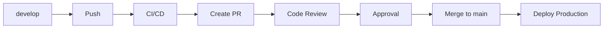

# 🔒 Configuração de Proteção da Branch Main

## ⚠️ CONFIGURAÇÃO MANUAL NECESSÁRIA

Para garantir que **NÃO** seja possível fazer merge direto na main, siga estas configurações:

### 📍 Acesso rápido
🔗 [Configurar Proteções](https://github.com/samuelmachado1/portifolioCultural/settings/branches)

### 🛡️ Configurações Obrigatórias

#### 1. Branch Protection Rules
No GitHub, acesse: **Settings** → **Branches** → **Add rule**

**Branch name pattern**: `main`

#### 2. Configurações Essenciais
Marque as seguintes opções:

✅ **Restrict pushes that create files larger than 100 MB**

✅ **Require a pull request before merging**
- ✅ Require approvals: **1**
- ✅ Dismiss stale reviews when new commits are pushed  
- ✅ Require review from code owners (se aplicável)

✅ **Require status checks to pass before merging**
- ✅ Require branches to be up to date before merging
- Status checks: (serão adicionados automaticamente quando workflows rodarem)

✅ **Require conversation resolution before merging**

✅ **Require signed commits** (opcional, mas recomendado)

✅ **Require linear history**

✅ **Include administrators**

✅ **Restrict pushes**
- ✅ Restrict pushes that create files
- Adicionar: `samuelmachado1` (ou manter vazio para bloquear todos)

#### 3. Configurações de Merge
Em **Settings** → **General** → **Pull Requests**:

✅ **Allow squash merging**
❌ **Allow merge commits**  
❌ **Allow rebase merging**

### 🚫 Resultado Final

Após essas configurações, será **IMPOSSÍVEL**:
- ❌ Push direto para main
- ❌ Merge sem Pull Request
- ❌ Merge sem aprovação
- ❌ Force push para main
- ❌ Deletar a branch main

### ✅ Fluxo Obrigatório



### 📋 Checklist de Configuração

- [ ] Acessar Settings → Branches
- [ ] Criar regra para branch `main`
- [ ] Marcar "Require a pull request before merging"
- [ ] Definir 1 aprovador necessário
- [ ] Marcar "Dismiss stale reviews"
- [ ] Marcar "Require conversation resolution"
- [ ] Marcar "Include administrators"
- [ ] Desabilitar merge commits diretos
- [ ] Testar tentativa de push direto (deve falhar)

### 🧪 Teste de Configuração

Para testar se está funcionando:

```bash
# Deve FALHAR
git checkout main
echo "test" > test.txt
git add test.txt
git commit -m "test"
git push origin main  # ❌ Deve ser rejeitado
```

### 🆘 Comandos de Emergência

Se algo der errado e precisar de acesso direto:

1. Ir em Settings → Branches
2. Clicar em "Edit" na regra da main
3. Desmarcar temporariamente "Include administrators"
4. Fazer a correção necessária
5. **IMPORTANTE**: Reativar "Include administrators"

---

## 📚 Links Úteis

- [GitHub Branch Protection](https://docs.github.com/en/repositories/configuring-branches-and-merges-in-your-repository/managing-protected-branches/about-protected-branches)
- [GitHub API Branch Protection](https://docs.github.com/en/rest/branches/branch-protection)

---

*⚠️ Lembre-se: Estas configurações são críticas para manter a qualidade e estabilidade do código em produção.*